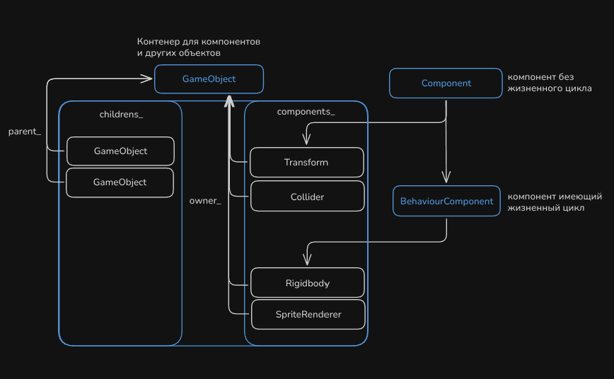
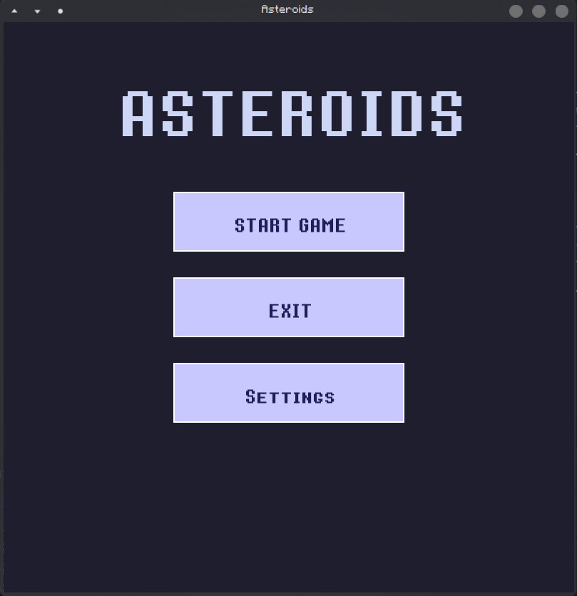
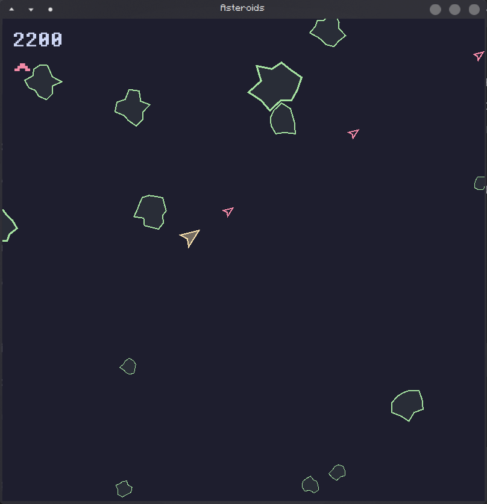
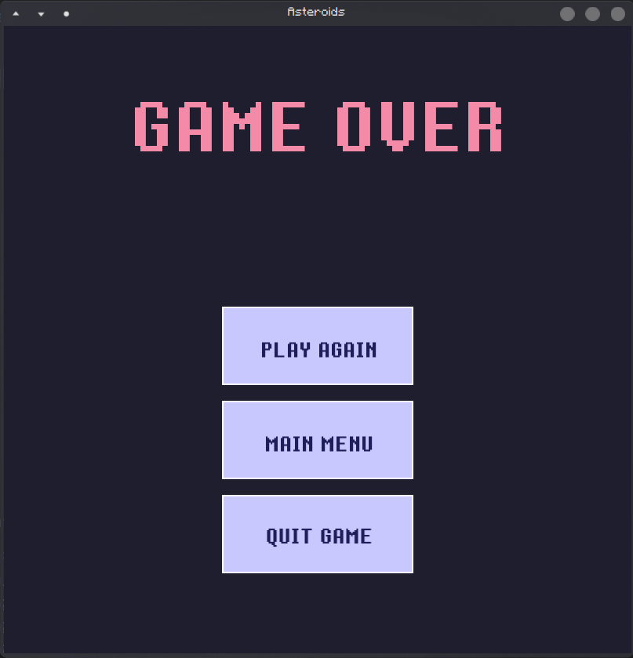

# Игра «Астероиды»

Классическая аркада «Астероиды», но с физикой столкновений. Проект построен на основе кастомного игрового движка с поддержкой SFML для рендеринга, аудио и ввода.
## Основные особенности
- **Компонентная архитектура** — игровые объекты состоят из переиспользуемых компонентов (Transform, Movement, Collider и др.)
- **Система сцен** — меню, игровая сцена, пауза, настройки, экран завершения
- **Система событий (Observer/Subject)** — декомпозированная коммуникация между компонентами
- **Физика и коллизии** — реализована система столкновений с разрешением физических взаимодействий
- **Управление звуком** — поддержка кроссфейда музыки, пул звуковых эффектов (криво и НЕ ДОДЕЛАНО)
- **Пользовательский интерфейс** — система UI с кнопками, слайдерами и текстом (кривовато и НЕ ДОДЕЛАНО)

## Структура проекта

### Основные модули
- **SFML‑обёртки** (`SFMLRenderer.h`, `SFMLAudioManager.h`, `SFMLInputEvent.h`) — адаптация SFML к интерфейсам движка
- **Базовые классы** (`GameObject.h`, `Component.h`, `BehaviourComponent.h`) — основа компонентной системы

- **Компоненты** (`Transform.h`, `Movement.h`, `CircleCollider.h`, `ConvexShape.h`) — функциональные части игровых объектов
- **Игровые объекты** (`Player.h`, `Asteroid.h`, `Bullet.h`) — конкретные сущности игры
- **Контроллеры** (`PlayerController.h`, `AsteroidController.h`, `BulletController.h`) — логика поведения
- **Менеджеры** (`AsteroidsManager.h`, `BulletManager.h`, `CollisionManager.h`, `GameSceneManager.h`) — управление группами объектов и сценами
- **Сцены** (`MenuScene.h`, `GameSceneImpl.h`, `PauseScene.h`, `SettingsScene.h`, `GameOverScene.h`) — экраны игры
- **События** (`GameEvents.h`, `Observer.hpp`) — система коммуникации между компонентами
- **Вспомогательные классы** (`Vectors.h`, `Logger.hpp`, `UIManager.h`, `GameArea.h`)
## Управление в игре
- **Стрелки** — движение и поворот корабля
- **Пробел** — стрельба
- **P** — пауза

---

[./v.gif](VIDEO-URL) 